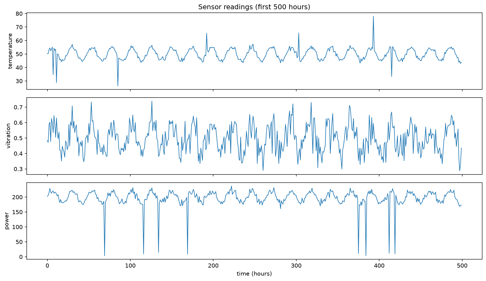
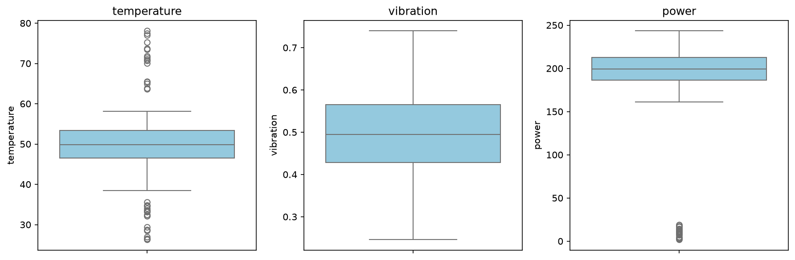
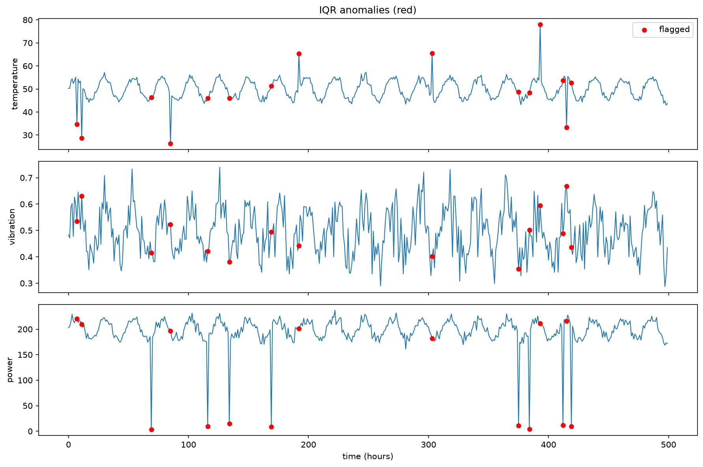
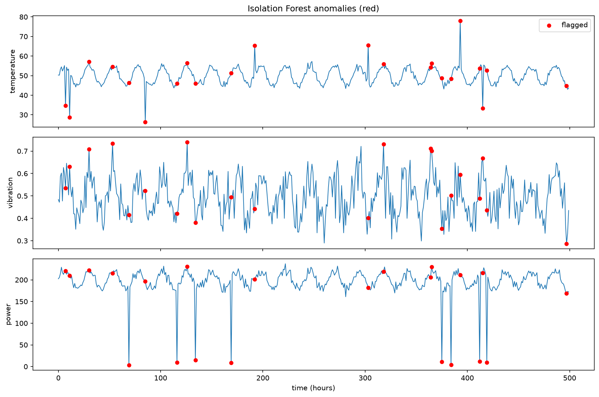
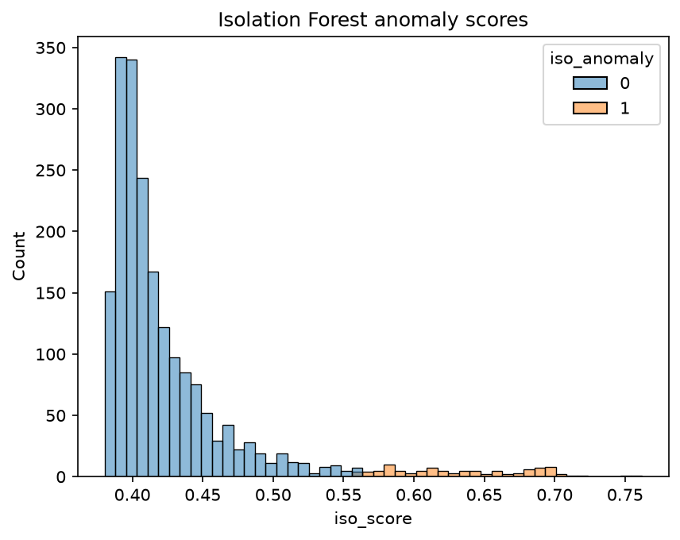
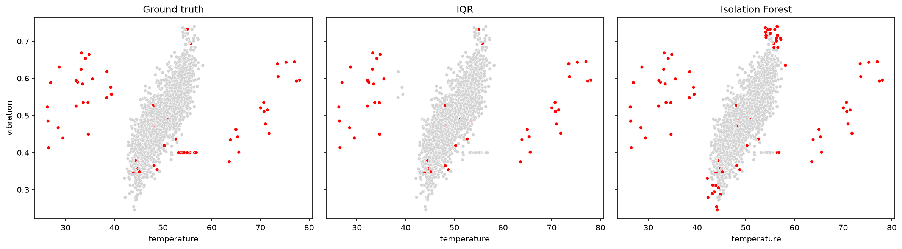

# Task 1: Anomaly Detection (IQR + Isolation Forest)

## Overview
This project detects anomalies in IoT sensor readings using two approaches: a statistical method (IQR rule) and an unsupervised machine learning method (Isolation Forest). The two are compared on precision, recall and F1.

## Dataset
A synthetic dataset of 2000 hourly readings from a machine with three sensors (temperature, vibration, power), saved as `sensor_data.csv`. Temperature follows a daily cycle and the other two sensors depend on it. I injected 100 anomalies (5.0%) of three kinds:
- **spike**: sudden temperature jump or drop
- **contextual**: vibration looks normal alone but is wrong for the current temperature
- **fault**: power reading collapses

The labels are used **only for evaluation**. Neither method sees them.



## Methods
**1. IQR rule.** A value is flagged if it lies outside `[Q1 - 1.5*IQR, Q3 + 1.5*IQR]`. It is applied to each sensor separately, and a reading is flagged if any sensor is an outlier.




**2. Isolation Forest.** Features are standardised, then 200 random trees isolate the data. Anomalies need fewer splits to be isolated, which gives them a higher anomaly score. `contamination=0.05`, `random_state=42`.




## Results
| Method | Flagged | Precision | Recall | F1 |
|---|---|---|---|---|
| IQR | 66 | 1.000 | 0.660 | 0.795 |
| Isolation Forest | 100 | 0.730 | 0.730 | 0.730 |

Share of each anomaly type caught:

| Anomaly type | IQR | Isolation Forest |
|---|---|---|
| contextual | 0% | 10% |
| fault | 100% | 100% |
| spike | 90% | 100% |



## Interpretation
- IQR caught 90% of spikes but only 0% of contextual anomalies. It checks one sensor at a time, so a reading that is normal on its own but wrong in combination goes unnoticed.
- Isolation Forest caught 100% of spikes and 10% of contextual anomalies because it considers all sensors together.
- IQR is simple, fast and explainable, but assumes a fixed range per feature. Isolation Forest handles relationships between features but needs the contamination rate and is harder to explain.

## How to Run
```bash
pip install -r requirements.txt
jupyter notebook anomaly_detection.ipynb
```
Run all cells from top to bottom. The notebook generates `sensor_data.csv` and the images.

## Limitations and Future Work
- The data is synthetic, and real data is messier. Next step: apply the same methods to a real dataset such as the Numenta Anomaly Benchmark.
- `contamination=0.05` matches the injected rate. In real use the rate is unknown and must be estimated or tuned.
- The IQR rule ignores the daily cycle. A rolling-window IQR or seasonal decomposition would catch more.
- Other methods to try: Local Outlier Factor, One-Class SVM, DBSCAN.
