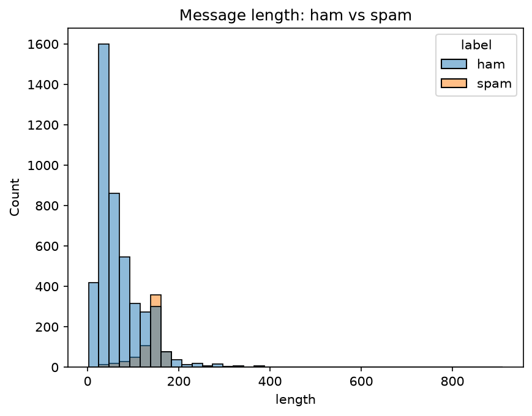
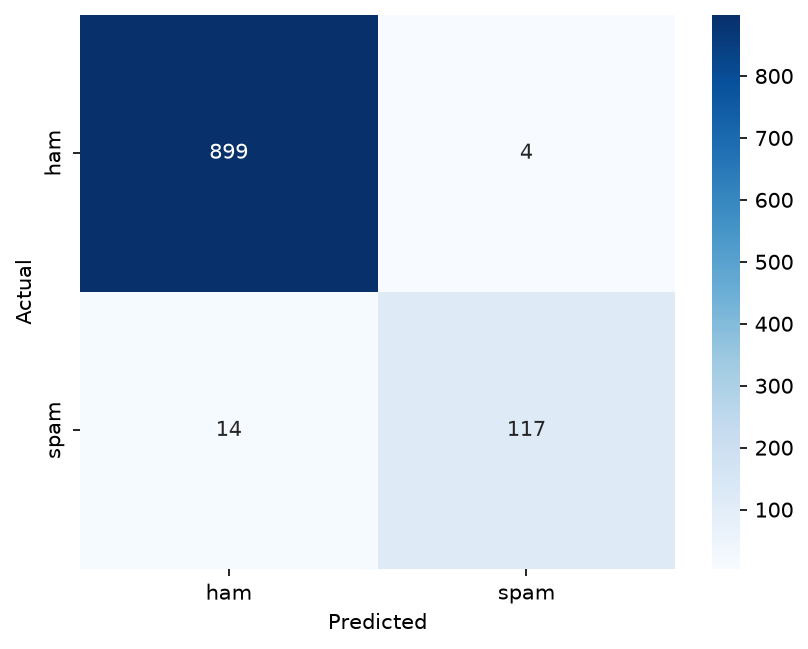

# Task 9: Spam Detector (TF-IDF + SVM)

## Overview
This project classifies SMS messages as **spam** or **ham** (not spam). Text is converted to numerical features with a TF-IDF vectorizer, and a Linear Support Vector Machine (SVM) separates the two classes.

## Dataset
- **Source:** SMS Spam Collection Dataset (UCI / Kaggle)
- **Size:** 5169 messages after removing duplicates
- **Classes:** 4516 ham (87.4%) and 653 spam (12.6%)
- The data is **imbalanced**, so accuracy alone is not enough. Precision, recall and F1 for the spam class are reported too.



Spam messages are longer than normal messages on average (138 vs 71 characters).

## Approach
1. **Cleaning:** kept the label and message columns, mapped ham to 0 and spam to 1, removed duplicates.
2. **Split:** stratified 80/20 train/test split (`random_state=42`), giving 4135 training and 1034 test messages.
3. **Features:** `TfidfVectorizer` with lowercase, English stop words and unigrams + bigrams.
4. **Model:** `LinearSVC` with `class_weight="balanced"` to handle the imbalance.
5. **Pipeline:** vectorizer and classifier are wrapped in one scikit-learn `Pipeline`, so the vectorizer is fit only on training data (no data leakage).
6. **Saved model:** `spam_model.joblib`.

## How to Run
```bash
pip install -r requirements.txt
jupyter notebook spam_detector.ipynb
```
Or open `spam_detector.ipynb` in VS Code and choose **Run All**. Make sure `spam.csv` is in the same folder as the notebook.

## Results
Evaluated on the held-out test set (1034 messages):

| Metric | Value |
|---|---|
| Accuracy | 98.26% |
| Spam precision | 0.967 |
| Spam recall | 0.893 |
| Spam F1-score | 0.929 |



**Interpretation:**
- Out of 131 real spam messages, the model caught 117 and missed 14.
- It wrongly flagged 4 normal messages as spam. This is the more costly mistake, since a real message could be lost.
- Overall the model separates the two classes well, and the spam-specific metrics confirm it is not just exploiting the class imbalance.

## Top Spam Indicators
Words with the highest spam weights in the model: uk, mobile, txt, claim, www, reply, ½1, com, text, 150p, service, prize, 50, stop, 146tf150p.

## Sample Predictions
| Message | Prediction |
|---|---|
| Congratulations! You've won a FREE iPhone. Click here to claim now! | SPAM |
| Hey, are we still meeting for lunch at 1? | HAM |
| URGENT: your account is suspended. Call 0800-123-456 immediately | SPAM |
| Can you send me the notes from today's class? | HAM |

## Project Structure
task_09_spam_detector/
├── spam_detector.ipynb # full workflow with outputs
├── spam.csv # dataset
├── spam_model.joblib # trained pipeline
├── requirements.txt
├── images/ # plots used in this README
└── README.md


## Challenges and Future Improvements
- **Class imbalance** was handled with class weights, but oversampling could also be tried.
- The model does not understand obfuscated words (for example "fr33" or "w1n").
- It is trained on English SMS only, so it may not generalize to emails.
- Next steps: hyperparameter tuning with `GridSearchCV`, a Naive Bayes baseline for comparison, and a transformer-based model.
