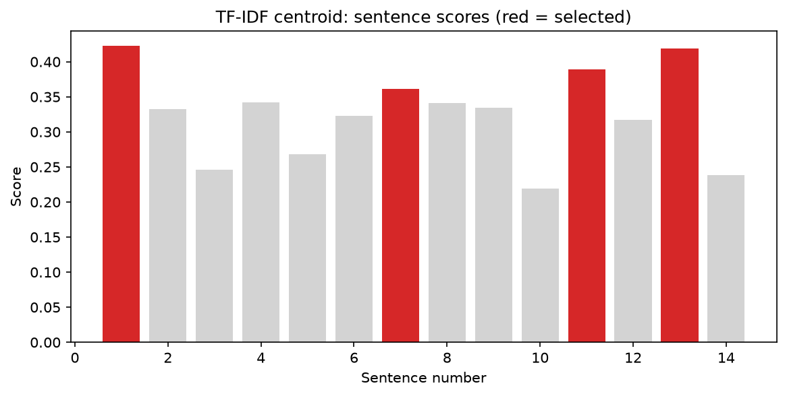
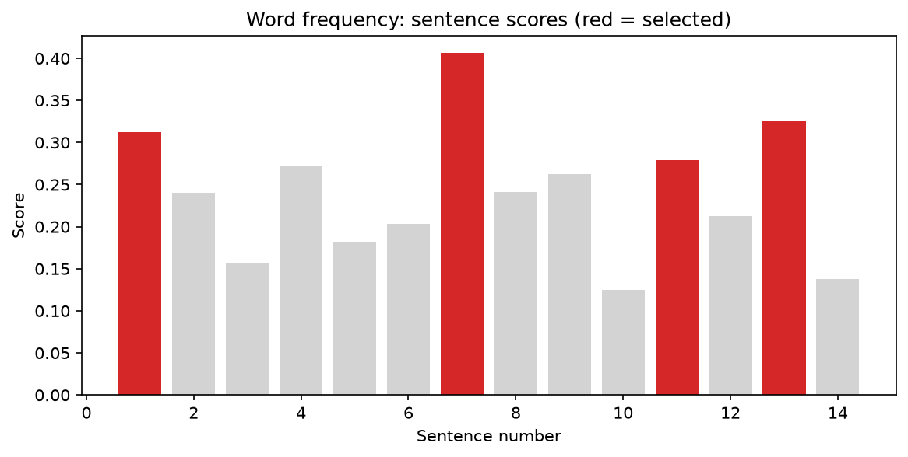

# Task 11: Document Summarizer (Extractive)

## Overview
A command-line tool that reads a text document and returns a short summary made of its most important sentences. It is **extractive**: it selects existing sentences and does not generate new text. Two ranking methods are implemented and compared.

## How it works
1. **Sentence splitting:** the text is cleaned and split into sentences with a regular expression (very short fragments are dropped).
2. **Scoring** (two methods):
   - **TF-IDF centroid:** each sentence becomes a TF-IDF vector (stop words removed). The document's average vector, the centroid, represents its overall topic. A sentence scores higher the more similar it is to the centroid (cosine similarity).
   - **Word frequency:** content words are counted across the whole document and normalised by the most frequent one. A sentence scores the average frequency of its words, which avoids favouring long sentences.
3. **Selection:** the top-scoring sentences are kept (30 percent by default) and put back in their **original order** so the summary reads naturally.

## How to Run
```bash
pip install -r requirements.txt
python summarizer.py sample_input.txt
python summarizer.py sample_input.txt --method freq
python summarizer.py sample_input.txt --sentences 3 --output summary.txt
python demo.py
```
Options: `--method tfidf|freq`, `--sentences N`, `--ratio 0.3`, `--output FILE`.

## Sample Input and Output
Input: [sample_input.txt](sample_input.txt), 14 sentences and 234 words about solar power.

**TF-IDF summary** ([sample_output_tfidf.txt](sample_output_tfidf.txt)):

> Solar power has grown from a niche technology into one of the cheapest sources of electricity in many parts of the world. However, solar power has real limitations. Better batteries are making it cheaper to store solar energy for the evening, and floating solar farms on reservoirs save land while reducing water evaporation. Many experts believe that solar energy will supply a large share of the world's electricity within the next twenty years.

**Word-frequency summary** ([sample_output_freq.txt](sample_output_freq.txt)):

> Solar power has grown from a niche technology into one of the cheapest sources of electricity in many parts of the world. However, solar power has real limitations. Better batteries are making it cheaper to store solar energy for the evening, and floating solar farms on reservoirs save land while reducing water evaporation. Many experts believe that solar energy will supply a large share of the world's electricity within the next twenty years.

## Results
| Method | Sentences kept | Words kept | Compression |
|---|---|---|---|
| TF-IDF centroid | 4 of 14 | 73 of 234 | 31% |
| Word frequency | 4 of 14 | 73 of 234 | 31% |

The two methods chose 4 of the same 4 sentences, so they largely agree on what matters.




## Limitations and Future Work
- The sentence splitter is a simple regex and can be fooled by abbreviations such as Dr. or e.g.
- Extractive summaries can sound choppy, because sentences are copied without rewriting and may refer to earlier context such as pronouns.
- Both methods ignore meaning and word order.
- Next steps: TextRank (a graph-based method), ROUGE evaluation against human summaries, NLTK tokenisation, and an abstractive transformer model.
